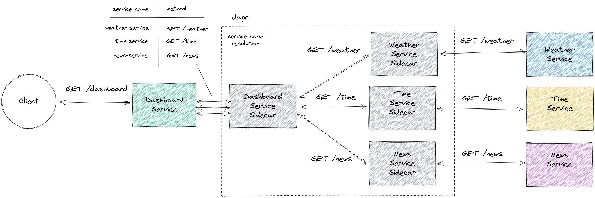

# dapr example - service invocation

<a href="https://www.dapr.io/"></a>

The following scenario is implemented here.



A client wants to have some information about the weather, the time and some news.
He retrieves these information via the _dashboard service_.
The dashboard service collects all these single information from three separate services.
But not by calling the services directly. Instead, the dashboard service requests its own
dapr sidecar to collect the information from the other services providing their _service names_ 
and _endpoint methods_.
The sidecar then requests the information from the other services sidecars.
This is where the dapr service invocation comes into play.


## Prerequisites

- [dapr CLI](https://docs.dapr.io/getting-started/install-dapr-cli/)
- Java (Version >=17)


## Get started

### 1. Build all services

```shell
./gradlew buildAllServices
```

### 2. Run each service alongside a dapr sidecar

```shell
dapr run --app-id dashboard-service --app-port 8080 --app-protocol http --dapr-http-port 3500 -- java -cp dashboard/build/libs/fat.jar com.example.DashboardKt
dapr run --app-id weather-service --app-port 8081 --app-protocol http --dapr-http-port 3501 -- java -cp weather/build/libs/fat.jar com.example.WeatherKt
dapr run --app-id time-service --app-port 8082 --app-protocol http --dapr-http-port 3502 -- java -cp time/build/libs/fat.jar com.example.TimeKt
dapr run --app-id news-service --app-port 8083 --app-protocol http --dapr-http-port 3503 -- java -cp news/build/libs/fat.jar com.example.NewsKt
```

As you can see, the dapr CLI is used to start up both, the dapr sidecar and the service.

### 3. Be the client - view the dashboard
```shell
curl http://localhost:8080/dashboard
```

# References
- [dapr concepts](https://docs.dapr.io/concepts/)
- [dapr service invocation explained](https://docs.dapr.io/developing-applications/building-blocks/service-invocation/service-invocation-overview/)
